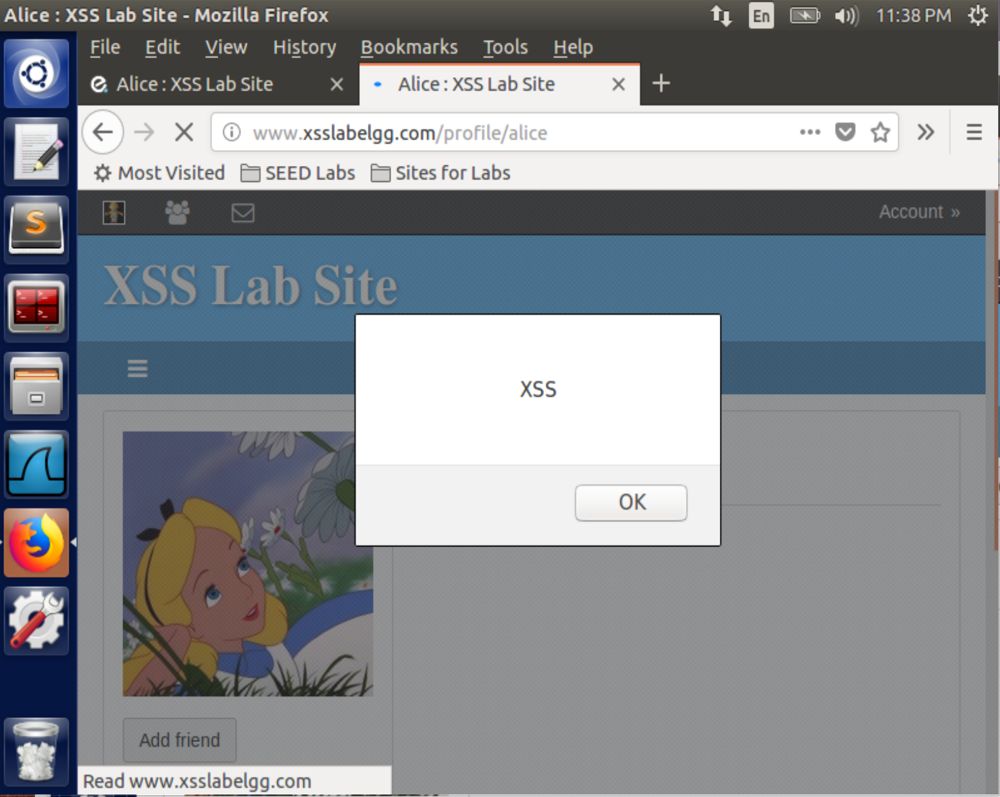
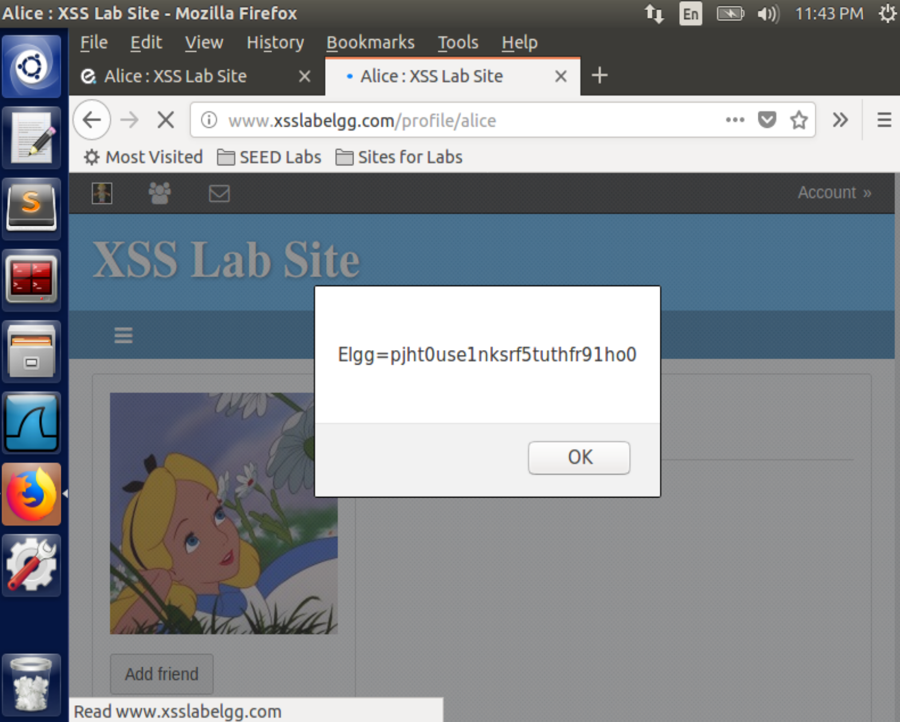
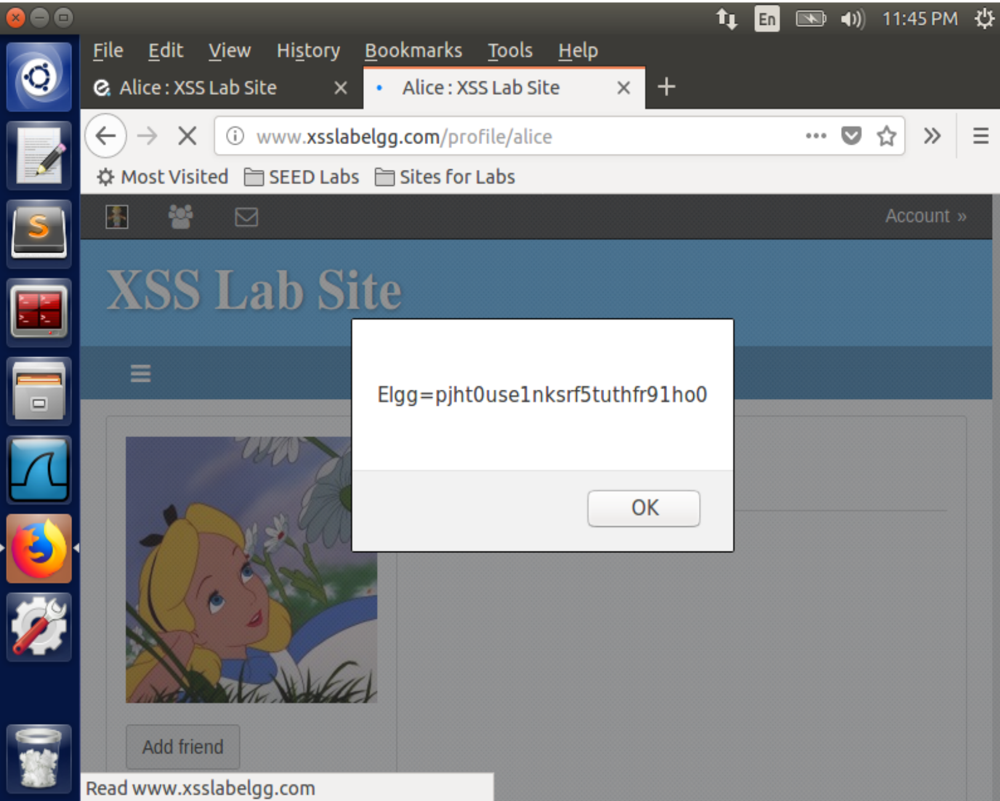

Instruction: https://seedsecuritylabs.org/Labs_16.04/PDF/Web_XSS_Elgg.pdf

# Set-up

2 VMs:

- attacker: `10.0.2.15`
- server: `10.0.2.4`

Edit the record in `etc/host` on the attacker:

```
10.0.2.4       www.xsslabelgg.com
```

Read the file `/etc/apache2/sites-available/000-default.conf`:

```conf
<VirtualHost *:80>
        ServerName http://www.xsslabelgg.com
        DocumentRoot /var/www/XSS/Elgg
</VirtualHost>
```

It shows that the sources of website `http://www.xsslabelgg.com` are hosted in `/var/www/XSS/Elgg`

# Task 1

For Firefox, `Web Developer` -> `Network` is also useful.

## Task 1.1

Log in with account `alice` and password `seedalice`, then edit `Brief description` module in `Profile` as:

```html
<script>alert('XSS');</script>
```

And save it.

Now, access http://www.xsslabelgg.com/profile/alice from either the server or the attacker, an alert prompts:



## Task 1.2

Edit the `Brief description` module and save:

```html
<script>alert(document.cookie);</script>
```

When accessing the profile page, it will show the cookie of the log-in user.

When Boby opens the page, it will be



For Alice herself:

